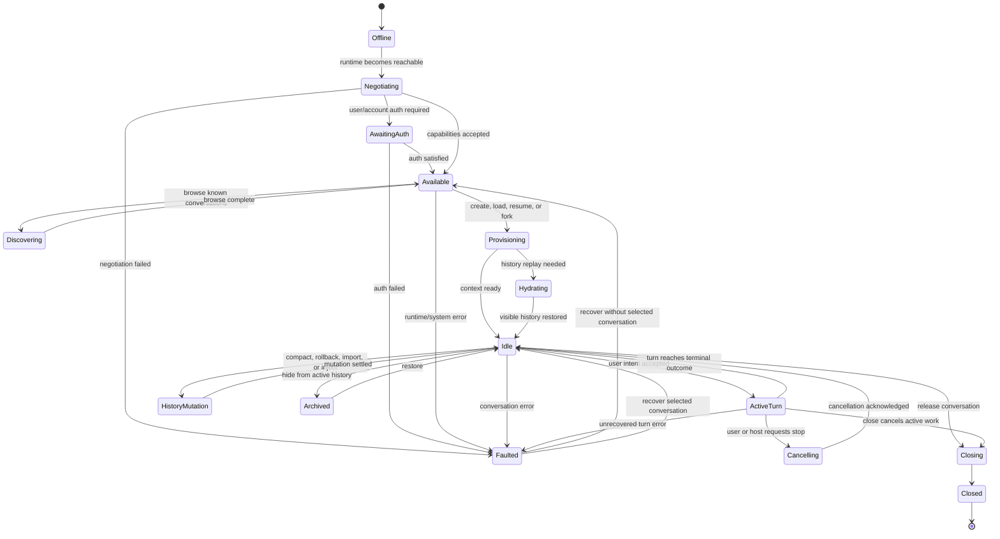
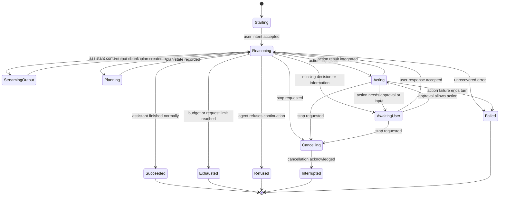
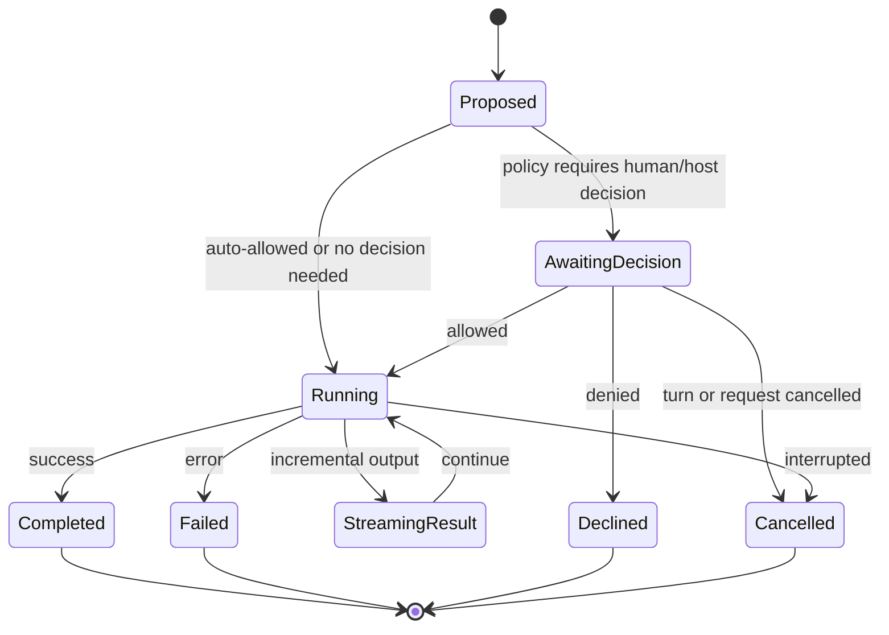
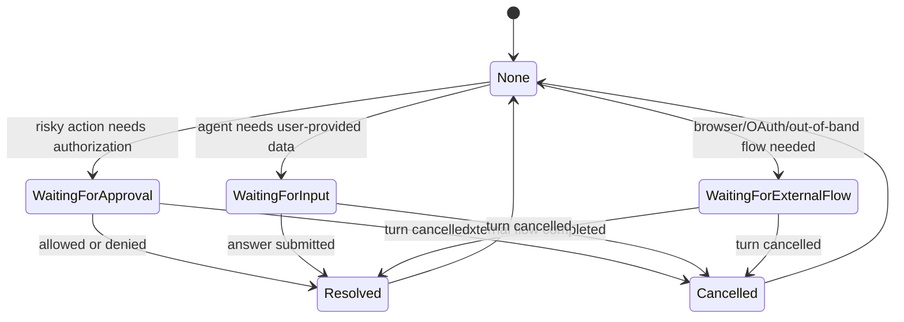
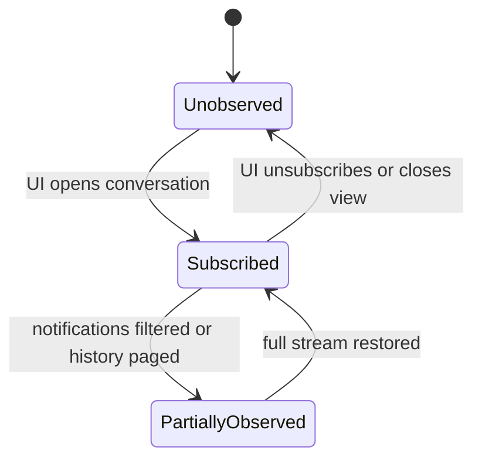

# 统一 Agent 状态机

这是一套用于 UI 和产品语义的 agent 状态机。它同时覆盖 ACP 的 `session` / `prompt turn` 模型，以及 Codex app-server 的 `thread` / `turn` / `item` 模型，但不把任何一边的协议枚举当成最终设计。

目标是回答三个问题：

- 用户现在能不能继续发消息？
- agent 现在是在思考、行动、等人、取消、结束，还是故障？
- 外部 UI 改变 agent 状态时，应该落在哪个语义层？

## 设计原则

统一状态机不是一个单层 enum，而是一个分层 statechart：

- Runtime: agent 服务是否可用，是否完成协商和鉴权。
- Conversation: 一条会话是否已加载、空闲、运行中、归档、关闭。
- Turn: 当前用户回合是否正在推理、执行动作、等待用户、取消或结束。
- Action: 单个工具、命令、文件修改、MCP 调用、动态工具或子 agent 调用的生命周期。
- Elicitation: agent 是否正在等待授权、选择、表单、OAuth 或其他用户输入。
- Context: 模型、模式、权限、cwd、环境、记忆、目标、历史等可变上下文。

这些层次是正交的。例如 conversation 可以是 `Active`，同时 turn 是 `AwaitingDecision`，同时 context 有一个 turn-scoped model override，action 里有一个 command 正在等待审批。

## 统一词汇

| 统一概念 | 含义 | ACP 中的对应 | Codex app-server 中的对应 |
| --- | --- | --- | --- |
| Runtime | agent 服务连接和能力协商状态 | 连接、初始化、鉴权 | app-server transport、initialize、账号/transport 鉴权 |
| Conversation | 一条可继续对话的上下文 | session | thread |
| Turn | 一次用户意图驱动的完整交互 | prompt turn | turn |
| Action | agent 在 turn 内发起的外部动作 | tool call、file/terminal/client capability request | item，尤其 command/file/MCP/dynamic/collab tool |
| Elicitation | agent 等待人或外部 UI 给决定 | permission request、可选 elicitation | approval request、requestUserInput、MCP elicitation |
| Context | 影响后续行为的设置和边界 | mode、config option、cwd、MCP servers | model、effort、approval policy、permission profile、cwd、memory、goal |
| History Mutation | 对历史或上下文摘要的结构性改动 | load/resume/replay、close；部分能力扩展 | resume、fork、rollback、compact、inject history |
| Observer | UI 是否仍订阅这条 conversation | client 是否接收 update | thread subscription / unsubscribe |

## 总体状态机



### 状态说明

| 状态 | UI 语义 | 覆盖范围 |
| --- | --- | --- |
| `Offline` | agent 不可达，不能发起会话操作 | transport 未连接、进程未启动、socket 不可用 |
| `Negotiating` | 正在确认能力和协议边界 | ACP initialize；Codex initialize |
| `AwaitingAuth` | 需要用户完成鉴权后才能继续 | ACP authMethods；Codex 账号或 websocket auth |
| `Available` | runtime 可用，但未必已有选中的 conversation | 可以 list/start/resume |
| `Discovering` | 正在枚举历史会话 | ACP session list；Codex thread list/read |
| `Provisioning` | 正在创建、恢复、fork 或连接 conversation | new/load/resume/fork/start |
| `Hydrating` | 正在把已有历史转成 UI 可见历史 | ACP load replay；Codex resume/read/turn list |
| `Idle` | 当前 conversation 可接收新的用户意图 | ACP session ready；Codex thread idle |
| `ActiveTurn` | agent 正在处理一个用户意图 | ACP prompt in flight；Codex turn inProgress / thread active |
| `Cancelling` | 取消已请求，但终态尚未确认 | ACP cancel pending；Codex interrupt pending |
| `HistoryMutation` | 正在改写历史、摘要或上下文结构 | compact、rollback、inject、import |
| `Archived` | conversation 存在但不在 active list 中 | Codex archive；ACP session list/delete 扩展可映射到这里 |
| `Closing` | 正在释放 conversation 资源 | close 或 close-like 行为 |
| `Closed` | conversation 不再可继续 | 需要重新 resume/load 或新建 |
| `Faulted` | 发生不可自动解释的错误 | system error、protocol error、unhandled turn failure |

## Turn 子状态机

`ActiveTurn` 不是一个原子状态。它内部至少包含推理、输出、动作、等待用户和取消。



### Turn 终态

| 统一终态 | UI 应表达的含义 | ACP 覆盖 | Codex 覆盖 |
| --- | --- | --- | --- |
| `Succeeded` | 本轮完成，可以继续发下一轮 | `end_turn` | `completed` |
| `Exhausted` | 预算、token 或内部请求次数耗尽，可以继续但应提示原因 | `max_tokens`、`max_turn_requests` | 通常表现为 completed 或 failed，取决于 server 归因 |
| `Refused` | agent 明确拒绝继续，本轮输入不应当被静默当作成功 | `refusal` | 可映射为 failed 或带拒绝语义的 completed item |
| `Interrupted` | 用户或宿主中断了本轮 | `cancelled` | `interrupted` |
| `Failed` | 非预期错误导致本轮失败 | JSON-RPC error 或 failed update | `failed`、thread `systemError` |

## Action 子状态机

Action 是 turn 内的可观察工作单元。它不局限于传统 tool call；命令执行、文件修改、MCP 工具、动态工具、网页搜索、图片生成、子 agent 调用都落在这一层。



### Action 类型归一

| 统一 Action 类型 | ACP 表达 | Codex 表达 |
| --- | --- | --- |
| `Read` | tool kind `read`、fs read | file/resource read item 或 MCP read |
| `Write` | tool kind `edit/delete/move`、diff | fileChange |
| `Command` | terminal action、execute tool | commandExecution |
| `Fetch` | fetch/search tool | webSearch、MCP/tool item |
| `MCPTool` | MCP server tool result through content/tool call | mcpToolCall |
| `DynamicTool` | client capability or extension method | dynamicToolCall |
| `Reasoning` | thought/message chunks | reasoning item、reasoning deltas |
| `Plan` | plan update | plan item、turn plan update |
| `SubAgent` | extension/custom tool | collabAgentToolCall |
| `Media` | image/audio content | imageView、imageGeneration、realtime items |
| `History` | replay/summary/close side effects | contextCompaction、rollback result |

## Elicitation 作为覆盖状态

Elicitation 是覆盖在 turn 或 action 上的“等待外部决定”状态。它不应该替代主状态，因为 agent 仍然处于 `ActiveTurn`，只是被某个外部回答阻塞。



常见判断：

- 授权类 elicitation 回答后，action 进入 `Running`、`Declined` 或 `Cancelled`。
- 信息类 elicitation 回答后，turn 回到 `Reasoning` 或 `Acting`。
- 取消 turn 时，所有未解决 elicitation 都必须进入 `Cancelled`。
- Codex 的 `waitingOnApproval` 和 `waitingOnUserInput` 是这一覆盖状态的显式标志；ACP 通过 pending request 和 cancel 语义表达。

## Context 状态不是主状态

Context 影响 agent 行为，但不应该把 conversation 从 `Idle` 或 `ActiveTurn` 中拆出去。它是一组带作用域的有效配置：

```text
effective context =
  runtime defaults
  + conversation defaults
  + current turn overrides
  + temporary grants
  + agent-emitted updates
```

| Context 维度 | 可变语义 | ACP 覆盖 | Codex 覆盖 |
| --- | --- | --- | --- |
| Model | 使用哪个模型或 provider | config option / model 扩展 | model、modelProvider、reroute |
| Reasoning | 推理强度或摘要策略 | config option `thought_level` | effort、summary |
| Mode | ask/plan/code 等行为模式 | mode 或 config option | collaboration mode、personality、instructions |
| Permissions | 是否能执行命令、写文件、联网 | permission option、client capabilities | approval policy、sandbox、permission profile |
| Workspace | cwd、可访问目录、环境 | session cwd、MCP servers | cwd、environment、filesystem permissions |
| Memory | 长期记忆是否参与 | 扩展或 agent-specific meta | memory mode、memory reset |
| Goal | 长时间任务目标和预算 | 扩展或 meta | thread goal |
| History | 历史、摘要、分支 | load/resume/replay | resume、fork、rollback、compact |

Context 变更规则：

- 变更 context 不一定代表 turn 开始或结束。
- 在 idle 时变更 context，影响下一轮。
- 在 active 时变更 context，只能影响后续步骤或后续 turn；UI 应显示“已更新但当前工作可能仍按旧上下文部分执行”。
- 临时授权和 turn override 到期后，应从 effective context 中移除。

## Observer 状态

Observer 是 UI 自己和 conversation 的关系，不是 agent 的核心业务状态。



这层用于解释 Codex 的 unsubscribe、notification opt-out、历史分页，以及 ACP 中 client 是否继续接收 update。它不能被当成 conversation closed：UI 不看，不等于 agent 不在。

## 状态归一表

| 统一状态 | ACP 信号 | Codex app-server 信号 |
| --- | --- | --- |
| `Negotiating` | initialization phase | initialize before ready |
| `AwaitingAuth` | authMethods / authenticate | account auth or websocket auth required |
| `Discovering` | session list | thread list / loaded list / read |
| `Provisioning` | session new/load/resume | thread start/resume/fork |
| `Hydrating` | session load replaying updates | resume/read/turns list populating history |
| `Idle` | session ready, no prompt in flight | thread status `idle` |
| `ActiveTurn` | prompt request in flight | thread status `active`, turn `inProgress` |
| `AwaitingDecision` | pending permission request | `waitingOnApproval` or approval request |
| `AwaitingUser` | elicitation or permission-like request | `waitingOnUserInput`, tool input request, MCP elicitation |
| `Acting` | tool call `in_progress` | command/file/MCP/dynamic/collab item `inProgress` |
| `Cancelling` | cancel sent, prompt not finalized | interrupt sent, turn not finalized |
| `Succeeded` | stop reason `end_turn` | turn `completed` |
| `Interrupted` | stop reason `cancelled` | turn `interrupted` |
| `Failed` | request error or failed tool terminal | turn `failed`, thread `systemError`, failed item |
| `Declined` | rejected permission option | declined command/file action |
| `HistoryMutation` | replay/resume/close extensions | compact、rollback、inject、fork |
| `Archived` | session hidden/delete extension | thread archived |
| `Closed` | session close | thread closed or no longer resumable in current runtime |

## 产品规则

1. `Idle` 是唯一适合启动普通新用户回合的状态。
2. `ActiveTurn` 期间的额外用户输入只能是 steering、排队输入或无效输入，具体取决于能力；它不是第二个独立 turn。
3. `Cancelling` 不是终态。UI 应继续渲染输出，直到 turn 进入终态。
4. 审批和用户输入是覆盖状态。展示它们时不要隐藏底层 action 和 turn。
5. action 被拒绝不等于 turn 必然失败。agent 可能恢复、换路径，或解释后正常结束。
6. 历史变更不等于工作区变更。rollback 和 compact 改的是对话记忆，不必然改磁盘文件。
7. archive、unsubscribe、closed 必须区分。archive 隐藏历史，unsubscribe 停止观察，close 释放或结束 conversation。
8. context update 会影响状态，但不是 turn outcome。它改变未来 agent 步骤被允许或倾向执行的行为。
9. `Faulted` 应尽可能保留最后已知的 conversation 和 turn 快照。UI 应区分可恢复 runtime 故障和已经完成的 failed turn。
10. 每个 turn 终态都必须让 conversation 回到 `Idle`、`Faulted` 或 `Closed`，不应长期停留在 `ActiveTurn`。

## 覆盖范围

This unified model covers:

- ACP initialization, optional authentication, session creation, listing, loading, resuming, prompting, cancellation, closing, config options, modes, plans, tool calls, permission requests, stop reasons, and session metadata updates.
- Codex app-server connection setup, thread start/resume/fork/archive/unarchive/unsubscribe/read/list, turn start/steer/interrupt, thread active flags, item lifecycle, approvals, user input requests, MCP elicitation, dynamic tool calls, plan/diff/message/reasoning streams, compact, rollback, memory, goals, config changes, and system errors.

这些状态名刻意保持协议中立。UI 适配层应把 ACP 或 Codex 信号翻译成这套统一状态，再由统一状态模型驱动展示。

## 参考来源

- ACP overview: `vendor/agent-client-protocol/docs/protocol/overview.mdx`
- ACP session setup: `vendor/agent-client-protocol/docs/protocol/session-setup.mdx`
- ACP prompt lifecycle: `vendor/agent-client-protocol/docs/protocol/prompt-turn.mdx`
- ACP tool calls and permissions: `vendor/agent-client-protocol/docs/protocol/tool-calls.mdx`
- ACP plans, modes, config: `vendor/agent-client-protocol/docs/protocol/agent-plan.mdx`、`session-modes.mdx`、`session-config-options.mdx`
- Codex app-server protocol: `codex app-server --help` and `codex app-server generate-ts --experimental`
